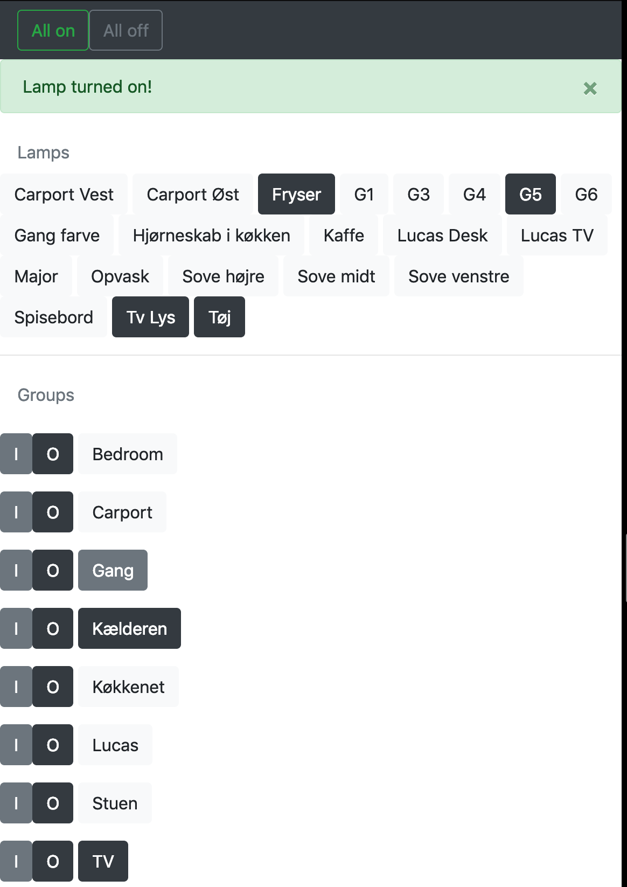

# Hue Lamps

## A flask app that lets you toggle all reachable Hue lights.

Enjoy!



Black and white represents whether the lamp if off or on

* Dimness and colors are not supported

## Installation

```bash
git clone https://github.com/gugi9000/lamper.git
```

Then enter into the folder and install requirements

```bash
cd lamper
pip3 install -r requirements.txt

```

While that's installing you should make a copy of `credentials.samplepy` called `credentials.py`.
Inside that edit it to match your Hue controller:
```python
from credlib import credential

home = credential(
    "192.168.1.2", "developer", "hash-string"
    # ^^IP of your controller,    ^^^ the hash string for the controller account
))
```

By now the requirements should be done installing. So you can go ahead and launch Flask:

```bash
flask run
```
